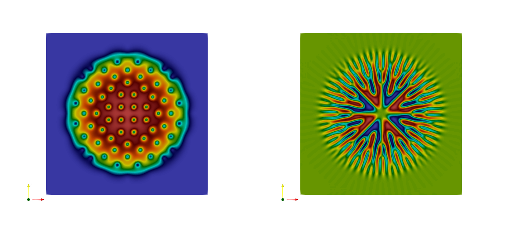

# Quick start

In order to have any simulation, you need to create a `Grid` and a `Field`. Then, you have to create parameters related to the simulation you want to perform, a numerical model which will be able to solve either time dependant or steady problems. You can be helped by initializers, read a field from file or use your custom function.

First, you need to start by importing the package:
```julia-repl
julia> using SuperFluids
```

Specify the grid resolution, and bounds of the box. You can then create a grid:
```julia-repl
julia> nx = 128;
julia> ny = 128;
julia> xrange = (-12, 12);
julia> yrange = (-12, 12);
julia> grid = Grid((nx,ny), (xrange,yrange))
Grid2D
  ├──────  resolution: 128×128
  ├───────  mesh size: 16384
  ├────  grid spacing: 0.1875×0.1875
  └──────────  domain: [-12.0,12.0]×[-12.0,12.0]
```

Here, in order to compute a Bose-Einstein Condensate, we need a complex field:
```julia-repl
julia> field = Field(grid, ComplexField())
Field2D
  ├──────  Array type: ComplexF64
  └──────────  memory: 0.00018310546875 MB
```

We want to compute the condensate using the Gross-Pitaevskii equation. To do so, we need to specify a `GrossPitaevskiiParameters` object. We need to specify a potential. Here we use a `PotentialQuadratic`.
```julia-repl
julia> γx = 1;
julia> γy = 1;
julia> param = GrossPitaevskiiParameters(
          β = 1000,
          Ω = 0.9,
          pot = PotentialQuadratic(field, γx = γx, γy = γy)
          )
GrossPitaevskiiParameters
  ├──────  equation solved:
  ├─────── idϕ/dt = -0.5 Δϕ + 1000 |ϕ|²ϕ  + V(x)ϕ - i Lz 0.9 ϕ
  └──────────────── coeffΔ: -0.5, β: 1000, Ω: 0.9
```

We want to initialize the field using a Thomas-Fermi approximation.
```julia-repl
julia> init = InitThomasFermi(field, param.β, γx = γx, γy = γy)
InitThomasFermi
  ├──────  parameters: γx 1 γy 1 β 1000
  ├──────────────  μ = √(β γx γy)
  └──────────────  ϕ = √( √μ - V )
julia> initField!(init)
```

Finally, we need to setup the numerical model.
```julia-repl
julia> Δt = 0.01;
julia> niter = 25;
julia> freqbckp = 10;
julia> nummodel = NumModelBackwardEuler(field, param, Δt, niter, freqbckp)
Backward Euler
  ├──────────  krylov: n iterations 70, tolerance 1.0e-8
  ├───────  time step: 0.01
  └──────────── solve: number of iterations 25, backup frequency 10
```

We can now solve our problem, using `solve!`:
```julia-repl
julia> solve!(nummodel, plot=false);
iteration 1
Angular Momentum Energy : 3.8116482626443515e-21
Kinetic + Potential Energy : 4.543728688204232
Interaction Energy : 8.028534738554772
Total Energy: 12.572263426759005
Number of Krylov iterations: 9
...
iteration 26
Angular Momentum Energy : 0.0001923996006739862
Kinetic + Potential Energy : 5.806637570014219
Interaction Energy : 6.1859314532471
Total Energy: 11.992376623660647
Number of Krylov iterations: 5
```

Result when converged (using more `niter`):

